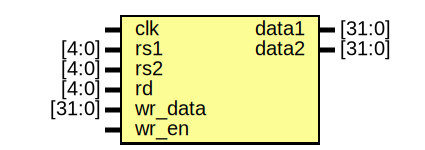

# Entity: register 

- **File**: Register.v

## Diagram

## Ports

| Port name | Direction | Type   | Description |
| --------- | --------- | ------ | ----------- |
| clk       | input     |        |             |
| rs1       | input     | [4:0]  |第一个读出数据地址             |
| rs2       | input     | [4:0]  |第二个读出数据地址             |
| rd        | input     | [4:0]  |写入数据地址             |
| wr_data   | input     | [31:0] |写入数据             |
| wr_en     | input     |        |写使能端口             |
| data1     | output    | [31:0] |第一个读出数据             |
| data2     | output    | [31:0] |第二个读出数据             |

## Signals

| Name     | Type       | Description |
| -------- | ---------- | ----------- |
| register | reg [31:0] |             |

## Processes
- unnamed: ( @(negedge clk) )
  - **Type:** always
