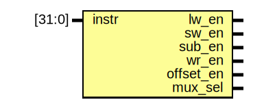

# Entity: control 

- **File**: control.v
## Diagram

## Description

 控制器

## Ports

| Port name | Direction | Type   | Description                            |
| --------- | --------- | ------ | -------------------------------------- |
| instr     | input     | [31:0] |                                        |
| lw_en     | output    |        | 请接入RAM(data_mem)接口, 在高电平时inout接口处于读的状态 |
| sw_en     | output    |        | 请接入RAM(data_mem)接口, 在高电平时inout接口处于写的状态 |
| sub_en    | output    |        | 请接入ALU                                 |
| wr_en     | output    |        | 请接入寄存器                                 |
| offset_en | output    |        | 请接入PC                                  |
| mux_sel   | output    |        | 用于JAL命令将地址写入RAM的指令                     |
