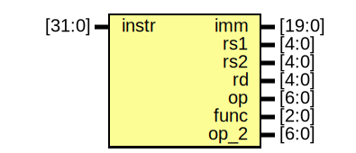

# Entity: decode 

- **File**: decode.v
## Diagram

## Description

 解码器

## Ports

| Port name | Direction | Type   | Description |
| --------- | --------- | ------ | ----------- |
| instr     | input     | [31:0] |             |
| imm       | output    | [19:0] | 请接入ext32以扩展 |
| rs1       | output    | [4:0]  | 请接入寄存器地址    |
| rs2       | output    | [4:0]  | 请接入寄存器地址    |
| rd        | output    | [4:0]  | 请接入寄存器地址    |
| op        | output    | [6:0]  | 请接入ALU      |
| func      | output    | [2:0]  | 请接入ALU      |
| op_2      | output    | [6:0]  | 请接入ALU      |

## Processes
- unnamed: ( @(*) )
  - **Type:** always

